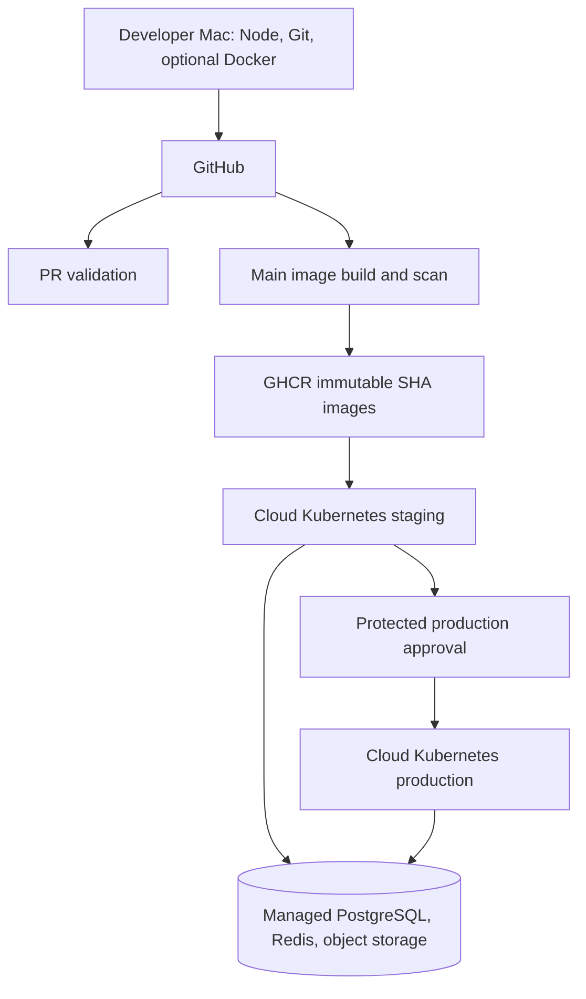

# Cloud Deployment Runbook

This guide deploys the existing application workspaces to a managed Kubernetes cluster. All cluster, database, cache, ingress, and monitoring workloads run in the cloud. No command in this guide starts Kubernetes on the developer Mac.

## Architecture



There are three deployable images in this repository: `frontend`, `auth-service`, and `booking-service`. Booking and payment APIs, durable notifications, and Socket.IO are one `booking-service` process. There are no separate payment-service or notification-service workspaces, images, Deployments, or HPAs. The ingress routes those API paths to booking-service. Split them in a separate application phase before expecting independent workloads.

## Cloud Prerequisites

These steps are manual in the selected cloud provider; the repository does not create cloud accounts or resources.

1. Create a managed Kubernetes cluster (EKS, GKE, AKS, DigitalOcean Kubernetes, or equivalent) and a node pool. Starting guidance: staging needs about 2 vCPU / 4 GiB allocatable; production should budget at least 4 vCPU / 8 GiB allocatable, plus system and ingress workloads. HPA can raise the booking workload; size nodes using observed metrics. See resource estimates below.
2. Install/configure a cloud ingress controller and ensure WebSocket upgrades work for `/socket.io`. The Ingress uses standard `networking.k8s.io/v1`; configure an `IngressClass` appropriate to the provider.
3. Install Metrics Server for HPA CPU metrics. Optionally install cert-manager and create a `ClusterIssuer` named `letsencrypt-prod`, or provision the referenced TLS Secret by the provider's certificate service.
4. Provision managed PostgreSQL and managed Redis with private network access from the cluster. Require TLS and restrict database/cache firewall rules to cluster/node egress.
5. Create an S3-compatible bucket (AWS S3, Cloudflare R2, or equivalent). Keep KYC objects private; grant the auth workload least-privilege read/write access. Profile images may be published using `OBJECT_STORAGE_PUBLIC_URL` or served through the auth media endpoint.
6. Configure workload identity / pod identity for object storage when supported. If static keys are unavoidable, inject them through the external secret mechanism, not Git.
7. Configure DNS for dev, staging, and production hostnames to the cloud ingress/load balancer. Replace example hostnames in the overlays and ConfigMap patches. Ensure each hostname has a TLS certificate before enabling public traffic.
8. Permit the ingress controller to reach only frontend/auth/booking Services. Keep auth and booking Services as `ClusterIP`; do not expose database, Redis, or `/metrics` publicly.
9. Configure GHCR pulls. The packages may be public, or create a namespace `imagePullSecret` using a narrowly scoped, read-only GitHub token and attach it to the default or workload ServiceAccount.
10. Configure a cloud secret manager (AWS Secrets Manager, Google Secret Manager, Azure Key Vault, or equivalent) and an External Secrets integration if available. Populate `kaamsetu-secrets` in the `kaamsetu` namespace from that store before the first rollout.

The checked-in `infra/k8s/base/secret.template.yaml` contains placeholders only and is not part of any Kustomize resource list. Never apply it with placeholder or real production credentials. The application pods expect a Secret named `kaamsetu-secrets`; the deploy workflow fails if it is absent.

## GitHub Configuration

Enable Actions and package publishing for the repository. The image workflow uses the repository's `GITHUB_TOKEN` with `packages: write`; no username is hardcoded. Main-branch images use immutable tags:

```text
ghcr.io/<owner>/<repository>/frontend:<git-sha>
ghcr.io/<owner>/<repository>/auth-service:<git-sha>
ghcr.io/<owner>/<repository>/booking-service:<git-sha>
```

Set repository **Variables** used at Next.js image build time:

- `NEXT_PUBLIC_API_URL=/api`
- `NEXT_PUBLIC_BOOKING_API_URL=/api`
- `NEXT_PUBLIC_GOOGLE_CLIENT_ID` (if Google sign-in is enabled)

The same-origin paths are intentional: browser requests use the active host, and Ingress sends auth-owned, more-specific API paths to auth-service and the `/api` catchall to booking-service. These public paths are baked into the frontend image but work unchanged in each environment. The profile Server Component uses runtime ConfigMap key `INTERNAL_API_URL=http://auth-service:4000/api` to call auth directly inside the cluster.

Create GitHub Environments named `staging` and `production`. Add environment **Variables**:

- `KUBE_CONTEXT`: expected context name in that environment's kubeconfig.
- `APP_BASE_URL`: environment's HTTPS app origin, used for post-deploy smoke check.

Add environment **Secrets**:

- `KUBECONFIG_B64`: base64-encoded deployment kubeconfig scoped to the target cluster/namespace.

The generic workflow consumes this kubeconfig secret to support provider-neutral clusters. Use short-lived credentials where possible and replace the credential step with the cloud provider's GitHub OIDC action (for example, EKS/GKE/AKS workload federation) before production. Do not use a cluster-admin kubeconfig; grant only namespace-scoped deployment permissions and required rollout reads. `id-token: write` is enabled for that provider-specific OIDC integration.

For production, configure GitHub Environment protection rules with required reviewers and restrict deployments to the intended branch. The `production` workflow job pauses for that approval. Staging can deploy automatically after the main image workflow succeeds.

## Application Configuration

Populate `kaamsetu-secrets` from the cloud secret manager with:

- `DATABASE_URL`: TLS managed PostgreSQL DSN shared by auth and booking.
- `JWT_ACCESS_SECRET`: shared random value, minimum 32 characters.
- `INTERNAL_SERVICE_SECRET`: shared random auth-to-booking notification key.
- `REDIS_URL`: TLS managed Redis URL (`rediss://...`) for Socket.IO fanout.
- `GOOGLE_CLIENT_ID`, `ADMIN_BOOTSTRAP_KEY` when needed; remove/empty bootstrap key after first admin creation.
- `RAZORPAY_KEY_ID`, `RAZORPAY_KEY_SECRET`, `RAZORPAY_WEBHOOK_SECRET`, `RAZORPAYX_KEY_ID`, `RAZORPAYX_KEY_SECRET`, and `RAZORPAYX_ACCOUNT_NUMBER` when money movement is enabled.
- `RESEND_API_KEY` and `RESEND_FROM_EMAIL` when critical email is enabled.
- `OBJECT_STORAGE_ACCESS_KEY_ID` and `OBJECT_STORAGE_SECRET_ACCESS_KEY` only if cloud workload identity is unavailable.

Update non-secret `OBJECT_STORAGE_BUCKET`, `OBJECT_STORAGE_REGION`, `OBJECT_STORAGE_ENDPOINT`, and `OBJECT_STORAGE_PUBLIC_URL` in the base ConfigMap/overlay patch before deployment. Production must use object storage; never mount a persistent upload volume into production pods. Upload temp paths are on pod `/tmp` and are ephemeral.

`COOKIE_SECURE` is true in the base ConfigMap. `CLIENT_ORIGIN` is overlaid per environment. Configure the same `JWT_ACCESS_SECRET` across auth and booking. Redis is expected in cloud deployments with multiple booking replicas; without it, Socket.IO rooms are process-local and notifications will not fan out between replicas.

## Deploy Flow

1. A pull request runs `pr-validation.yml`: `npm ci`, frontend lint, available tests, all workspace builds, dependency audit, and `kustomize build` for dev/staging/prod. It does not contact a cluster.
2. A successful merge to `main` runs `container-publish.yml`, builds/scans/pushes SHA-tagged images to GHCR for `linux/amd64` and `linux/arm64`.
3. Successful image publication triggers `cloud-deploy.yml` for staging. It selects the exact source commit SHA, rewrites image refs in the staging overlay, checks the cluster, ensures the namespace Secret exists, applies the overlay, waits for all three Deployments, then checks `APP_BASE_URL`.
4. Verify the staging application manually: login, booking/payment test mode, admin KYC review, dispute/payout behavior (with test credentials), Socket.IO notifications, DNS/TLS, and logs/metrics.
5. Start `cloud-deploy.yml` via **Run workflow**, select `production`, and approve the protected GitHub Environment deployment. It applies the production overlay and waits for rollouts.
6. Verify the production URL, API health, managed dependency connectivity, image SHA, storage permissions, and cloud telemetry.

The workflow writes kubeconfig only under the ephemeral GitHub runner temp directory. It runs `kubectl` against the configured cloud context. No local kubeconfig is required.

## Ingress, Health, and Monitoring

Ingress routes `/` to frontend; `/api/auth`, `/api/profiles`, `/api/admin/providers`, and `/media/profiles` to auth; `/api` and `/socket.io` to booking. The booking backend owns `/api/bookings`, `/api/payments`, `/api/notifications`, other booking APIs, and general `/api/admin` operations. Confirm the selected ingress controller supports WebSocket upgrade and configure HTTPS redirects/HSTS at the controller or cloud load balancer. cert-manager compatibility is included via the `letsencrypt-prod` issuer annotation.

Backend readiness probes call `/health` (database readiness; booking also checks Redis if configured). Liveness/startup probes call `/api/health`, which checks process responsiveness without making a database failure restart-loop the app. `GET /metrics` exposes request totals and latency histograms; Services have Prometheus scrape annotations, and `infra/k8s/monitoring/prometheus-scrape-config.yaml` is an optional scrape-job snippet. Logs are JSON access records on stdout/stderr and should be collected by the cloud provider's logging agent.

For production, use provider-native monitoring or deploy Prometheus/Grafana in the cloud. Monitor pod CPU/memory, restarts, readiness, request rate/latency/status, database pool saturation, Redis availability, Razorpay webhook failures, and object-storage errors. Do not install monitoring on the Mac.

## Rollback (Cloud Cluster Only)

Run these from a secured operator workstation with credentials for the cloud cluster, or through an approved cloud operations runner. Never point them at a local cluster.

```sh
kubectl config current-context
kubectl -n kaamsetu rollout status deployment/frontend
kubectl -n kaamsetu rollout history deployment/booking-service
kubectl -n kaamsetu rollout undo deployment/booking-service
kubectl -n kaamsetu rollout undo deployment/auth-service
kubectl -n kaamsetu rollout undo deployment/frontend
kubectl -n kaamsetu rollout status deployment/booking-service --timeout=5m
```

Identify the failing Deployment from `kubectl -n kaamsetu get deployments,pods` and `kubectl -n kaamsetu describe deployment/<name>`. Inspect cloud logs/events, roll back only affected workloads, verify probes and smoke tests, then correct and redeploy a new image SHA. `rollout undo` restores the prior ReplicaSet image; it does not revert database migrations or secret/config changes. Plan schema changes to remain backward-compatible across a rollback.

## Starting Resource Estimates

Base requests: frontend `100m/256Mi`, auth `100m/256Mi`, booking `150m/256Mi`; production overlay raises these. Base limits are frontend/auth `500m/512Mi`, booking `750m/768Mi`; production limits are higher. Staging starts at two pods each. Production starts at frontend/auth three and booking two. Booking HPA targets 70% CPU, minimum 2 and maximum 10 replicas in staging/prod; dev patches it to 1–2. Metrics Server is required. Payment has no separate HPA because it is not an independent process.

At the production minimum, requests are approximately 1.85 CPU and 3.25 GiB RAM before cluster/system/ingress overhead. At ten booking replicas, application requests rise to roughly 3.85 CPU and 7.25 GiB RAM. These are starting estimates only; adjust after load testing and observing real metrics. Keep spare node capacity for rolling updates and autoscaling.

## Local Workflow

Continue developing directly with Node.js/npm. Docker Compose remains optional for local application testing. Do not install Kubernetes, `kubectl`, Minikube, Kind, k3d, MicroK8s, a local ingress controller, or Prometheus/Grafana on the Mac. The pull-request workflow validates manifests with Kustomize rendering only and never creates a cluster.
